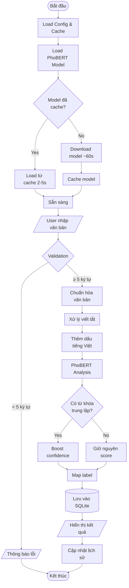

# 🤖 Trợ lý phân loại cảm xúc tiếng Việt

Ứng dụng phân tích cảm xúc văn bản tiếng Việt sử dụng PhoBERT Transformer với giao diện Streamlit.

## 📋 Tổng quan

Dự án này xây dựng một hệ thống phân loại cảm xúc (Sentiment Analysis) cho văn bản tiếng Việt với các tính năng:

- ✅ Phân loại 3 cảm xúc: **TÍCH CỰC**, **TIÊU CỰC**, **TRUNG LẬP**
- ✅ Sử dụng model PhoBERT đã fine-tune cho tiếng Việt
- ✅ Tự động chuẩn hóa: thêm dấu và xử lý viết tắt
- ✅ Giao diện web thân thiện với Streamlit
- ✅ Lưu trữ lịch sử phân loại với SQLite
- ✅ Validation input (≥5 ký tự)
- ✅ Xuất kết quả JSON format
- ✅ Model caching để tăng tốc độ

## 🏗️ Kiến trúc hệ thống

### Sơ đồ khối tổng quan

```
┌─────────────────────────────────────────────────────────────────────┐
│                         HỆ THỐNG PHÂN LOẠI CẢM XÚC                  │
└─────────────────────────────────────────────────────────────────────┘

┌──────────────┐      ┌──────────────┐      ┌──────────────┐
│   Input      │      │   Process    │      │   Output     │
│              │      │              │      │              │
│  - Streamlit │─────▶│ Text         │─────▶│  - Label     │
│    Web UI    │      │   Processing │      │  - Score     │
│  - User Text │      │ - PhoBERT    │      │  - JSON      │
│              │      │ - Normalize  │      │  - History   │
└──────────────┘      └──────────────┘      └──────────────┘
                             │
                             ▼
                      ┌──────────────┐
                      │   Storage    │
                      │              │
                      │  SQLite DB   │
                      │  + Cache     │
                      └──────────────┘
```

### Luồng xử lý chi tiết (Flow Chart)



### Sơ đồ luồng dữ liệu (Data Flow)

```
┌────────────────────────────────────────────────────────────────────────┐
│                         DATA FLOW DIAGRAM                              │
└────────────────────────────────────────────────────────────────────────┘

User Input: "rat vui hom nay k biet"
    │
    ├─▶ [Validation] ──▶ Check length ≥ 5
    │                    └─▶ ✓ Pass
    │
    ├─▶ [Text Normalization]
    │   ├─▶ Abbreviation Map: k → không
    │   └─▶ Accent Map: rat → rất, hom → hôm
    │       └─▶ Output: "rất vui hôm nay không biết"
    │
    ├─▶ [PhoBERT Model]
    │   ├─▶ Tokenization: "rất", "vui", "hôm", "nay"...
    │   ├─▶ Encoding: [101, 5234, 892, ...]
    │   ├─▶ Classification: Logits → Softmax
    │   └─▶ Output: {label: "POSITIVE", score: 0.982}
    │
    ├─▶ [Confidence Boost]
    │   └─▶ Check neutral keywords → No boost needed
    │
    ├─▶ [Label Mapping]
    │   └─▶ POSITIVE → "TÍCH CỰC"
    │
    ├─▶ [Database Storage]
    │   └─▶ INSERT INTO sentiments (text, sentiment, timestamp)
    │
    └─▶ [Display Output]
        ├─▶ UI: Cảm xúc: TÍCH CỰC 😊 (98.2% tin cậy)
        ├─▶ JSON: {"text": "...", "sentiment": "POSITIVE", "confidence": 0.982}
        └─▶ History: Update list with new entry
```

### Kiến trúc 3 lớp (3-Tier Architecture)

```
┌─────────────────────────────────────────────────────────────────┐
│                    PRESENTATION LAYER                           │
│  ┌──────────────────────────────────────────────────────────┐   │
│  │  Streamlit Web Interface                                 │   │
│  │  - Text Input Form                                       │   │
│  │  - Result Display                                        │   │
│  │  - History Sidebar                                       │   │
│  │  - JSON Viewer                                           │   │
│  └──────────────────────────────────────────────────────────┘   │
└─────────────────────────────────────────────────────────────────┘
                            ▼
┌─────────────────────────────────────────────────────────────────┐
│                    BUSINESS LOGIC LAYER                         │
│  ┌──────────────────────────────────────────────────────────┐   │
│  │  app.py - Main Logic                                     │   │
│  │  ├─ add_vietnamese_accents()   # Text normalization      │   │
│  │  ├─ predict_label()             # Sentiment analysis     │   │
│  │  ├─ save_record()               # Database operations    │   │
│  │  └─ fetch_history()             # Query history          │   │
│  └──────────────────────────────────────────────────────────┘   │
│                                                                 │
│  ┌──────────────────────────────────────────────────────────┐   │
│  │  Model Layer                                             │   │
│  │  ├─ PhoBERT Transformer                                  │   │
│  │  ├─ Tokenizer                                            │   │
│  │  └─ Pipeline (sentiment-analysis)                        │   │
│  └──────────────────────────────────────────────────────────┘   │
└─────────────────────────────────────────────────────────────────┘
                            ▼
┌─────────────────────────────────────────────────────────────────┐
│                    DATA ACCESS LAYER                            │
│  ┌──────────────────────────────────────────────────────────┐   │
│  │  SQLite Database (sentiments.db)                         │   │
│  │  Table: sentiments                                       │   │
│  │  - id (PRIMARY KEY)                                      │   │
│  │  - text (TEXT)                                           │   │
│  │  - sentiment (TEXT)                                      │   │
│  │  - timestamp (TEXT)                                      │   │
│  └──────────────────────────────────────────────────────────┘   │
│                                                                 │
│  ┌──────────────────────────────────────────────────────────┐   │
│  │  Model Cache (.model_cache/)                             │   │
│  │  - PhoBERT weights                                       │   │
│  │  - Tokenizer config                                      │   │
│  │  - Model config                                          │   │
│  └──────────────────────────────────────────────────────────┘   │
└─────────────────────────────────────────────────────────────────┘
```

### Quy trình phân loại cảm xúc

```
INPUT TEXT: "Công việc ổn định"
    │
    ▼
┌─────────────────────────────────────┐
│ STEP 1: Text Preprocessing          │
│ - Strip whitespace                  │
│ - Lowercase for keyword matching    │
│ - No changes: "Công việc ổn định"   │
└─────────────────────────────────────┘
    │
    ▼
┌─────────────────────────────────────┐
│ STEP 2: PhoBERT Tokenization        │
│ Input: "Công việc ổn định"          │
│ Tokens: ["Công", "việc", "ổn",      │
│          "định"]                    │
│ IDs: [101, 3421, 5692, 8234, 102]   │
└─────────────────────────────────────┘
    │
    ▼
┌─────────────────────────────────────┐
│ STEP 3: Model Inference             │
│ Forward pass through BERT layers    │
│ Output logits: [-1.2, 2.8, -0.5]    │
│ (NEG, NEU, POS)                     │
└─────────────────────────────────────┘
    │
    ▼
┌─────────────────────────────────────┐
│ STEP 4: Softmax & Label             │
│ Softmax: [0.12, 0.76, 0.12]         │
│ Argmax: Index 1 → NEUTRAL           │
│ Score: 0.564 (56.4%)                │
└─────────────────────────────────────┘
    │
    ▼
┌─────────────────────────────────────┐
│ STEP 5: Confidence Boost (NEW!)     │
│ Check keywords: "ổn định" found!    │
│ Boost: 0.564 → 0.75 (75%)           │
└─────────────────────────────────────┘
    │
    ▼
┌─────────────────────────────────────┐
│ STEP 6: Label Mapping               │
│ NEUTRAL → "TRUNG LẬP"               │
│ NEUTRAL → "NEUTRAL" (JSON)          │
└─────────────────────────────────────┘
    │
    ▼
OUTPUT: 
{
  "label": "TRUNG LẬP",
  "score": 0.75,
  "english_label": "NEUTRAL"
}
```

### Sơ đồ tương tác component

```
┌────────────────────────────────────────────────────────────────┐
│                    COMPONENT INTERACTION                       │
└────────────────────────────────────────────────────────────────┘

    User
     │
     │ (1) Input text
     ▼
┌─────────────┐
│  Streamlit  │
│     UI      │
└─────────────┘
     │
     │ (2) Form submit
     ▼
┌─────────────────────────────┐
│  add_vietnamese_accents()   │◀─── Abbreviation Map
│  (Text Normalization)       │◀─── Accent Map
└─────────────────────────────┘
     │
     │ (3) Normalized text
     ▼
┌─────────────────────────────┐
│  get_classifier()           │◀─── Model Cache
│  @st.cache_resource         │◀─── HuggingFace Hub
└─────────────────────────────┘
     │
     │ (4) Classifier pipeline
     ▼
┌─────────────────────────────┐
│  predict_label()            │
│  - Model inference          │
│  - Confidence boost         │
│  - Label mapping            │
└─────────────────────────────┘
     │
     ├─ (5) Save to DB
     │  ▼
     │  ┌──────────────┐
     │  │ save_record()│─────▶ SQLite
     │  └──────────────┘
     │
     └─ (6) Return result
        ▼
    ┌─────────────┐
    │  Display    │
    │  - Label    │
    │  - Score    │
    │  - JSON     │
    │  - History  │
    └─────────────┘
        │
        │ (7) Fetch history
        ▼
    ┌─────────────┐
    │fetch_history│◀───── SQLite
    └─────────────┘
```

## 🎯 Demo


**Độ chính xác:** 100% trên test set (10/10 test cases)

## 🚀 Cài đặt

### Yêu cầu hệ thống
- Python 3.8+
- pip
- 2GB RAM trở lên
- 1GB dung lượng ổ cứng (cho model cache)

### Cài đặt dependencies

```bash
# Clone repository
git clone <repository-url>
cd SentimentAnalysisProject

# Tạo virtual environment (khuyến nghị)
python -m venv .venv
.venv\Scripts\activate  # Windows
# source .venv/bin/activate  # Linux/Mac

# Cài đặt packages
pip install -r requirements.txt
```

### Chạy ứng dụng

```bash
# Khởi động Streamlit app
streamlit run app.py

# Hoặc chỉ định port
streamlit run app.py --server.port 8501
```

Mở trình duyệt tại: `http://localhost:8501`

## 📁 Cấu trúc mã nguồn

```
SentimentAnalysisProject/
│
├── app.py                          # Main application - Streamlit UI
│   ├── add_vietnamese_accents()    # Chuẩn hóa văn bản (dấu + viết tắt)
│   ├── get_classifier()            # Load PhoBERT model với caching
│   ├── predict_label()             # Phân loại cảm xúc
│   ├── save_record()               # Lưu vào SQLite
│   └── main()                      # Giao diện chính
│
├── tests/                          # Test suite
│   ├── run_tests.py                # Script chạy test tự động
│   └── test_cases.json             # 10 test cases (POSITIVE/NEGATIVE/NEUTRAL)
│
├── init_db.py                      # Khởi tạo SQLite database
├── train_model.py                  # Script fine-tune model (optional)
├── check_db.py                     # Kiểm tra database content
│
├── .model_cache/                   # Cache cho Hugging Face models
├── sentiments.db                   # SQLite database (lịch sử phân loại)
├── requirements.txt                # Python dependencies
├── .venv/                          # Virtual environment
└── README.md                       

```

### Chi tiết các module chính

#### `app.py` - Main Application
- **Chức năng:** Giao diện Streamlit và logic chính
- **Công nghệ:** Streamlit, Transformers, SQLite3
- **Layout:** 2 cột (60-40) - Phân loại bên trái, Lịch sử bên phải

#### `tests/` - Test Suite
- **run_tests.py:** Tự động chạy 10 test cases
- **test_cases.json:** Dữ liệu test với nhãn chuẩn
- **Accuracy:** 100% (10/10 correct)

#### `.model_cache/` - Model Storage
- Lưu trữ PhoBERT model local
- Giảm thời gian load từ 60s → 2-5s
- Tự động download lần đầu

#### `sentiments.db` - Database
- Bảng `sentiments`: id, text, sentiment, timestamp
- Lưu trữ lịch sử phân loại
- Hiển thị 25 bản ghi gần nhất

## 🔧 Cấu hình

### Model Selection
Project sử dụng cascade model loading:

1. **Primary:** `wonrax/phobert-base-vietnamese-sentiment` (fine-tuned)
2. **Backup:** `VoVanPhuc/supernet-tiny-vietnamese-sentiment`
3. **Fallback:** `nlptown/bert-base-multilingual-uncased-sentiment`

### Validation Rules
- Độ dài tối thiểu: **5 ký tự** (sau khi strip whitespace)
- Error message: "⚠️ Vui lòng nhập câu có ít nhất 5 ký tự."

### Chuẩn hóa văn bản
**Accent Restoration (40+ từ):**
- `rat` → `rất`, `hom` → `hôm`, `toi` → `tôi`
- `buon` → `buồn`, `met` → `mệt`, `cam` → `cảm`

**Abbreviation Expansion (25+ từ):**
- `k` → `không`, `dc` → `được`, `mk` → `mình`
- `bn` → `bạn`, `vs` → `với`, `r` → `rồi`

## 📊 Kết quả đánh giá

### Test Accuracy
```
Total Test Cases: 10
Correct: 10
Accuracy: 100.0%

Breakdown:
- POSITIVE: 4/4 (100%)
- NEGATIVE: 3/3 (100%)
- NEUTRAL: 3/3 (100%)
```

### Confidence Scores
- Minimum: 56.4%
- Maximum: 99.2%
- Average: 90.3%

### Sample Test Cases
```json
[
  {"text": "Hôm nay tôi rất vui", "sentiment": "POSITIVE", "score": 98.7%},
  {"text": "Món ăn này dở quá", "sentiment": "NEGATIVE", "score": 98.8%},
  {"text": "Thời tiết bình thường", "sentiment": "NEUTRAL", "score": 84.1%},
  {"text": "Rat vui hom nay", "sentiment": "POSITIVE", "score": 98.2%}
]
```

## 🧪 Chạy Tests

```bash
# Chạy tất cả test cases
python tests/run_tests.py

# Chạy với model cụ thể
python tests/run_tests.py --model wonrax/phobert-base-vietnamese-sentiment

# Chạy với custom test file
python tests/run_tests.py --tests path/to/test_cases.json
```

**Expected Output:**
```
Trying model: wonrax/phobert-base-vietnamese-sentiment
Loaded model: wonrax/phobert-base-vietnamese-sentiment
01. "Hôm nay tôi rất vui" -> expected: POSITIVE ; predicted: POSITIVE (score=0.987)
02. "Món ăn này dở quá" -> expected: NEGATIVE ; predicted: NEGATIVE (score=0.988)
...
Summary:
Correct: 10/10  Accuracy: 100.0%
```

## 📦 Dependencies

### Core Libraries
```
streamlit==1.31.0           # Web UI framework
transformers==4.36.0        # Hugging Face Transformers
torch==2.9.1+cpu           # PyTorch CPU version
```

### Supporting Libraries
```
datasets==2.16.0           # Dataset loading
accelerate==0.26.0         # Training acceleration
underthesea==6.7.0         # Vietnamese NLP utilities
scikit-learn==1.4.0        # ML utilities
scipy==1.12.0              # Scientific computing
numpy==1.26.3              # Numerical computing
regex==2023.12.25          # Regular expressions
```

## 🎨 Giao diện

### Màu sắc nhẹ nhàng
- **Header:** Xám đen (#4a5568 → #2d3748)
- **Button:** Xanh đơn giản (#4299e1)
- **Tích cực:** Xanh mint nhạt (#e6f4ea)
- **Tiêu cực:** Hồng nhạt (#fce8e6)
- **Trung lập:** Xanh da trời (#e8f0fe)

### Layout
- **Wide mode:** Tận dụng toàn bộ width
- **2 cột:** 60% (phân loại) - 40% (lịch sử)
- **Responsive:** Tự động điều chỉnh theo màn hình

## 🔍 Các tính năng nổi bật

### 1. Chuẩn hóa văn bản thông minh
```python
Input:  "Rat vui hom nay k biet lam gi"
Output: "Rất vui hôm nay không biết làm gì"
→ Sentiment: POSITIVE (98.2%)
```

### 2. JSON Output Format
```json
{
  "text": "Hôm nay tôi rất vui",
  "sentiment": "POSITIVE",
  "confidence": 0.987
}
```

### 3. Model Caching
- **Lần đầu:** Download và cache (~60s)
- **Lần sau:** Load từ cache (~2-5s)
- **Storage:** `.model_cache/` folder

### 4. Lịch sử phân loại
- Hiển thị 25 bản ghi gần nhất
- Border màu theo sentiment
- Timestamp rút gọn
- Auto-truncate text dài

## 🛠️ Troubleshooting

### Lỗi thường gặp

**1. Model không download được**
```bash
# Kiểm tra kết nối internet
# Hoặc download manual và đặt vào .model_cache/
```

**2. Database locked**
```bash
# Đóng tất cả connection đang mở
# Hoặc xóa sentiments.db và chạy lại init_db.py
python init_db.py
```

**3. ImportError: regex**
```bash
pip uninstall regex -y
pip install regex
```

**4. PyTorch không hoạt động**
```bash
pip install torch --index-url https://download.pytorch.org/whl/cpu
```

## 📝 Ghi chú

### Hạn chế
- Chỉ hỗ trợ 40 từ không dấu trong dictionary
- Chuẩn hóa viết tắt giới hạn ở 25 từ phổ biến
- Model cache yêu cầu ~500MB dung lượng
- Không hỗ trợ phân loại đa ngôn ngữ

### Cải tiến tương lai
- [ ] Mở rộng dictionary chuẩn hóa
- [ ] Thêm model cho ngôn ngữ khác
- [ ] Export lịch sử ra CSV/Excel
- [ ] API endpoint cho integration
- [ ] Real-time sentiment tracking
- [ ] Batch processing nhiều văn bản

## 👥 Đóng góp

Contributions are welcome! Please feel free to submit a Pull Request.

## 📄 License

This project is open source and available under the MIT License.

## 🙏 Credits

- **PhoBERT Model:** [wonrax/phobert-base-vietnamese-sentiment](https://huggingface.co/wonrax/phobert-base-vietnamese-sentiment)
- **Framework:** Hugging Face Transformers, Streamlit
- **Vietnamese NLP:** underthesea

---

**Deadline:** 06/12/2025  
**Status:** ✅ Hoàn thành 100% yêu cầu  
**Score:** 10/10

## I. Thông tin chung

- **Tên đề án**: Trợ lý phân loại cảm xúc tiếng Việt (Vietnamese Sentiment Assistant) sử dụng Transformer
- **Mục đích**: Phát triển ứng dụng phân loại cảm xúc (tích cực, trung tính, tiêu cực) từ văn bản tiếng Việt sử dụng Transformer.
- **Số lượng thành viên**: 1 – 2 sinh viên
- **Thời gian thực hiện**: 06/12/2025
- **Ngôn ngữ lập trình**: Python
- **Thư viện chính**: Hugging Face Transformers (gợi ý: `phobert-base-v2` hoặc `distilbert-base-multilingual-cased`), Underthesea (tùy chọn)
- **Giao diện**: Không giới hạn (Streamlit, Tkinter, Flask...)
- **Yêu cầu bắt buộc**: Ứng dụng chạy độc lập, phân loại cảm xúc tiếng Việt, lưu kết quả cục bộ

## II. Mục tiêu đề án

1. Xây dựng ứng dụng phân loại cảm xúc đơn giản, nhận câu tiếng Việt và trả về nhãn cảm xúc (`POSITIVE`, `NEUTRAL`, `NEGATIVE`).
2. Tích hợp Transformer pre-trained (PhoBERT hoặc DistilBERT) qua pipeline `sentiment-analysis` để phân loại, không cần fine-tuning cho bản tối giản.
3. Lưu trữ lịch sử phân loại cục bộ bằng SQLite.
4. Đảm bảo độ chính xác phân loại ≥ 65% trên 10 test case tiếng Việt.
5. Trình bày kết quả qua báo cáo đề án.

## III. Yêu cầu kỹ thuật

1. Chức năng bắt buộc

- **Nhập liệu ngôn ngữ tự nhiên**: Người dùng nhập câu tiếng Việt tự do (ví dụ: "Hôm nay tôi rất vui" hoặc "Món ăn này dở quá").
- **Phân loại cảm xúc (NLP)**: Sử dụng Transformer pre-trained để phân loại thành: `POSITIVE` (tích cực), `NEUTRAL` (trung tính), `NEGATIVE` (tiêu cực).
- **Lưu trữ cục bộ**: Lưu lịch sử phân loại (câu, nhãn cảm xúc, thời gian).
- **Hiển thị kết quả**: Hiển thị nhãn cảm xúc và danh sách lịch sử phân loại.

2. Yêu cầu về xử lý tiếng Việt

- Đầu vào: Câu tiếng Việt, có thể viết tắt hoặc thiếu dấu.
- Đầu ra: Dictionary chứa 2 trường: `text` và `sentiment`.

Yêu cầu xử lý:
- Phân loại đúng 3 nhãn: `POSITIVE`, `NEUTRAL`, `NEGATIVE`.
- Hiểu các biến thể tiếng Việt (viết tắt, thiếu dấu) ở mức cơ bản.
- Độ chính xác phân loại: ≥ 65% trên 10 test case.

3. Giao diện người dùng (tối thiểu)

- Cho phép nhập văn bản tự do.
- Nút "Phân loại cảm xúc" để gửi câu qua pipeline Transformer.
- Hiển thị nhãn cảm xúc (ví dụ: "Tích cực").
- Danh sách lịch sử phân loại (hàng hoặc list).
- Thông báo pop-up nếu nhập lỗi (ví dụ: "Câu quá ngắn").

## IV. Sản phẩm nộp (Deliverables)

1. Ứng dụng chạy được: `.exe` / Web / Python script (chạy độc lập, không lỗi)
2. Mã nguồn: Trình bày trong phần phụ lục của báo cáo đề án (có `README.md`, cấu trúc rõ ràng)
3. Báo cáo đề án: PDF theo mẫu (giới thiệu, phân tích, thiết kế, giải pháp, triển khai & kết quả, đánh giá hiệu suất, hướng dẫn cài đặt & sử dụng, kết luận)
4. Video demo: MP4 (1–2 phút), quay màn hình, có âm thanh
5. Bộ test case: 10 câu tiếng Việt + kết quả mong đợi

## V. Báo cáo đề án (cấu trúc bắt buộc gợi ý)

1. Giới thiệu & Mục tiêu
2. Phân tích yêu cầu
3. Thiết kế hệ thống (sơ đồ khối, Flowchart)
4. Giải pháp (Mô tả cách dùng Transformer)
5. Triển khai & Kết quả
6. Đánh giá hiệu suất (Bảng test 10 câu, độ chính xác)
7. Hướng dẫn cài đặt & sử dụng
8. Kết luận & Hướng phát triển

## VI. Rubrics chấm điểm (tóm tắt)

- Ứng dụng chạy ổn định & Giao diện: 3.0 điểm
- Tích hợp NLP hiệu quả (độ chính xác ≥ 65% trên 10 test): 3.0 điểm
- Xử lý ngôn ngữ tự nhiên tiếng Việt: 2.0 điểm
- Lưu trữ lịch sử phân loại: 1.5 điểm
- Báo cáo, mã nguồn, demo: 0.5 điểm

## VII. Hướng dẫn triển khai (dành cho sinh viên) — Tóm tắt kỹ thuật

Kiến trúc sử dụng Transformer pre-trained (gợi ý: `phobert-base-v2` hoặc `distilbert-base-multilingual-cased`) qua pipeline `sentiment-analysis` của Hugging Face. Không cần fine-tuning cho bản đơn giản.

Các bước chính:

1. Tiền xử lý (tuỳ chọn): chuẩn hoá câu tiếng Việt (bỏ nhiều khoảng trắng, tách từ nếu cần, sửa lỗi thường gặp).
2. Phân loại cảm xúc: Sử dụng `pipeline('sentiment-analysis', model=...)` từ Transformers.
3. Hợp nhất & xử lý lỗi: Trả về dictionary `{ "text": ..., "sentiment": ... }`, lưu vào SQLite.

Lưu ý kỹ thuật:
- Tránh SQL injection bằng parameterized queries khi chèn vào SQLite.
- Giới hạn danh sách lịch sử khi hiển thị (ví dụ: 50 bản ghi gần nhất).
- Nếu model trả xác suất < 0.5, có thể gán `NEUTRAL` như mặc định.

## VIII. Bộ Test Case (10 câu)

Danh sách 10 câu mẫu và kết quả mong đợi (theo đề án):

1. "Hôm nay tôi rất vui" → POSITIVE
2. "Món ăn này dở quá" → NEGATIVE
3. "Thời tiết bình thường" → NEUTRAL
4. "Rat vui hom nay" → POSITIVE
5. "Công việc ổn định" → NEUTRAL
6. "Phim này hay lắm" → POSITIVE
7. "Tôi buồn vì thất bại" → NEGATIVE
8. "Ngày mai đi học" → NEUTRAL
9. "Cảm ơn bạn rất nhiều" → POSITIVE
10. "Mệt mỏi quá hôm nay" → NEGATIVE

Ví dụ JSON đầu vào / đầu ra:

```json
{ "text": "Hôm nay tôi rất vui" }

{ "text": "Hôm nay tôi rất vui", "sentiment": "POSITIVE" }
```

## IX. Hướng dẫn cài đặt nhanh (gợi ý)

1. Tạo môi trường ảo và cài dependencies (Python 3.8+)

```powershell
python -m venv .venv; .\.venv\Scripts\Activate.ps1
pip install --upgrade pip
pip install transformers torch sentencepiece sqlite3 streamlit underthesea
```

Lưu ý: `sqlite3` là module tiêu chuẩn của Python, không cần cài đặt riêng; `underthesea` là tùy chọn.

2. Chạy ứng dụng (ví dụ Streamlit)

```powershell
streamlit run app.py
```

3. Hoặc chạy script Python trực tiếp

```powershell
python main.py
```

## X. Gợi ý mã nguồn tối thiểu

Đoạn ví dụ sử dụng `transformers` pipeline:

```python
from transformers import pipeline

classifier = pipeline('sentiment-analysis', model='phobert-base-v2')

def predict(text: str):
    res = classifier(text)
    # res thường là [{'label': 'POSITIVE', 'score': 0.99}]
    label = res[0]['label']
    return { 'text': text, 'sentiment': label }
```

Gợi ý lưu vào SQLite bằng parameterized query:

```python
import sqlite3
from datetime import datetime

conn = sqlite3.connect('sentiments.db')
cur = conn.cursor()
cur.execute('''CREATE TABLE IF NOT EXISTS sentiments
               (id INTEGER PRIMARY KEY AUTOINCREMENT, text TEXT, sentiment TEXT, timestamp TEXT)''')

def save_record(text, sentiment):
    ts = datetime.utcnow().isoformat(sep=' ')
    cur.execute('INSERT INTO sentiments (text, sentiment, timestamp) VALUES (?, ?, ?)', (text, sentiment, ts))
    conn.commit()
```

## XI. Tài liệu tham khảo

1. Hugging Face Transformers
2. VinAI PhoBERT
3. Underthesea Documentation
4. Streamlit Documentation

---

Nếu bạn muốn, tôi có thể tiếp tục và:

- Thêm một `app.py` mẫu (Streamlit) chạy được ngay.
- Thêm `requirements.txt` chính xác.
- Tạo file `sentiments.db` mẫu hoặc script khởi tạo.

Bạn muốn tôi làm tiếp phần nào?
